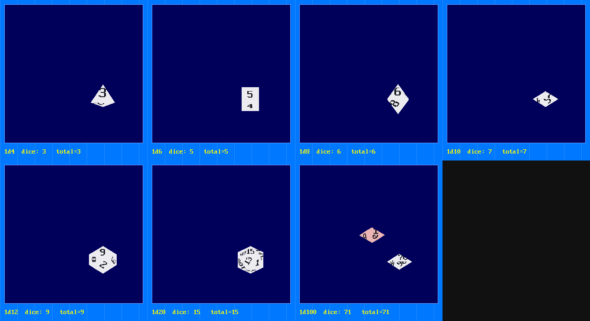

# DICE3D — 3D Polyhedral Dice for QB64PE

A drop-in module that rolls animated 3D dice inside a configurable, top-down
"dice box" that overlays your existing screen. You call one sub, the dice
tumble/bounce/settle with physics, control returns to you, and you read the
results. Built to fold into `QB64_GJ_LIB`.



## Highlights

- **Dice notation** — `XdY` plus modifiers: `4d6dl1` (drop lowest 1), `2d20kh1`
  (keep highest), `3d6+2` (flat bonus), `1d100` / `d%` (percentile).
- **Every standard die** — d4, d6, d8, d10, d12, d20, and d100 (as a tens +
  units d10 pair).
- **Box overlay** — only the box rectangle is ever drawn over; the rest of your
  screen is untouched. The box back can be opaque or transparent.
- **Real tray physics** — dice hop under gravity, bounce off the walls, push
  apart so they never stack, then settle to show their rolled value.
- **Materials** — Solid, Crystal (translucent), Marble (veined), Noise (grainy).
- **Look controls** — body colour, number colour, edge colour or transparent
  edges, bevel amount (sharp → rounded), and die size.
- **D6 pips** — dots, squares, or a sprite, instead of a numeral.
- **Custom faces** — map any value to a cell of a sprite sheet (e.g. a smiley on
  1, a skull on 20). Per-value, any die.
- **Percentile colours** — independent body colours for the high (tens) and low
  (units) die.
- **Drop-lowest** — drop the N lowest dice with a fade or explode effect;
  `DICE3D_LAST_TOTAL` holds the kept sum.
- **Sound hooks** — optional edge-bounce and settle SFX (you supply the
  `_SNDOPEN` handles).

## Files

| File | Role |
|------|------|
| `_ALL.BI` / `_ALL.BM` | Aggregated includes (include these two) |
| `_CFG.BI` | `DICE3D_CONFIG`, `DICE3D_SPEC`, enums |
| `_DICE.BI` | Core types + engine globals |
| `_MISC.BM` | Vector + quaternion math, helpers |
| `_GEO.BM`  | Generic convex-hull mesh builder + die vertex sets |
| `_TEX.BM`  | Face-atlas baking: materials, bevel, numbers, pips, sprite maps |
| `_RENDER.BM` | Software 3D renderer (project → painter-sort → `_MAPTRIANGLE`) |
| `_PHYSICS.BM` | Tumble / bounce / settle |
| `_DICE.BM` | Public API: defaults, parser, `dice3d_roll`, percentile, drop FX, `dice3d_repose` |
| `_IO.BM`   | Save/load: config, dice set, and named themes (KEY=value text) |
| `DICE3D-TEST.BAS` | Interactive configurator (F5 to run) |
| `DICE3D-SHOT.BAS` / `DICE3D-FACES.BAS` | Headless demos / verification harnesses |

## Quick start

```basic
OPTION _EXPLICIT
$IF FALSE = UNDEFINED AND TRUE = UNDEFINED THEN
    CONST FALSE = 0: CONST TRUE = NOT FALSE
$END IF
'$INCLUDE:'_ALL.BI'

SCREEN _NEWIMAGE(800, 600, 32)
CLS , _RGB32(0, 120, 255)          ' your game screen

DIM cfg AS DICE3D_CONFIG
dice3d_config_defaults cfg
cfg.BOX_X = 250: cfg.BOX_Y = 160: cfg.BOX_W = 300: cfg.BOX_H = 300

REDIM results(1 TO 1) AS INTEGER
dice3d_roll "4d6dl1", cfg, results()   ' animates in the box, hands control back

PRINT "dice:";
DIM i AS INTEGER
FOR i = 1 TO UBOUND(results): PRINT results(i);: NEXT
PRINT "   total ="; DICE3D_LAST_TOTAL   ' kept sum + flat modifier

'$INCLUDE:'_ALL.BM'      ' at the very bottom of your program
```

`results()` is re-sized to `(1 TO count)` and filled with each die's value.
After the roll, `DICE3D_DICE(i).DROPPED` tells you which dice were dropped.

> **Display note:** the roll loop drives `_DISPLAY` itself. Game loops that
> already call `_DISPLAY` need no change.

## Public API

| Call | Purpose |
|------|---------|
| `dice3d_config_defaults cfg` | Fill a config with sensible defaults |
| `dice3d_roll notation$, cfg, results()` | Roll, animate, return values + `DICE3D_LAST_TOTAL` |
| `dice3d_set_face value%, cell%` | Map a value to a sprite-sheet cell |
| `dice3d_face_reset` | Clear all custom face mappings |

## Notation

```
  XdY                 X dice of Y sides            4d6, 1d20, 2d8
  dlN / dhN           drop lowest / highest N      4d6dl1, 5d6dl2
  khN / klN           keep highest / lowest N      2d20kh1
  +N / -N             flat modifier                3d6+2, 1d20-1
  d100 or d%          percentile (tens + units)    1d100, d%
```

## Runtime result API (query after a roll)

```basic
dice3d_roll "4d6dl1", cfg, r()
FOR i = 1 TO dice3d_count%          '  number of result entries
    PRINT dice3d_value%(i);         '  each die's value
    IF dice3d_dropped%(i) THEN PRINT "(dropped)";
NEXT
PRINT dice3d_total%                 '  kept sum + flat modifier
PRINT dice3d_sides%                 '  die type (100 = percentile)
```

Values are decided by **physics** - the die tumbles and comes to rest on a
face; no artificial end-of-roll snap. Fairness comes from the randomized throw
(`cfg.SPIN_STRENGTH` / `cfg.THROW_STRENGTH`).

## Save / load (dice sets + themes)

```basic
' one config
dice3d_config_save cfg, "mydie.txt"
IF dice3d_config_load%(cfg, "mydie.txt") THEN ...

' a whole set = one config per die type (d4 d6 d8 d10 d12 d20 d100)
DIM set(0 TO 6) AS DICE3D_CONFIG
dice3d_set_save set(), "diceset.txt"
IF dice3d_set_load%(set(), "diceset.txt") THEN ...
'   ... then use set(dice3d_set_index%(6)) as the cfg for a d6, etc.

' named colour theme -> theme_<name>.txt
dice3d_theme_save "ruby", cfg
IF dice3d_theme_load%("ruby", cfg) THEN ...
```

Files are readable `KEY=value` text. Handle fields (font/sprite/sound) are not
saved; `FONT_PX` records the intended font size so a program can reload it.

## Key config fields (`DICE3D_CONFIG`)

```
  BOX_X/Y/W/H          box rectangle (screen pixels, top-down)
  BOX_SHOW_OUTLINE     draw the box border
  BOX_OUTLINE_KOLOR    border colour
  BOX_SHOW_BACK        TRUE = fill box, FALSE = transparent overlay
  BOX_BACK_KOLOR       box fill colour (deep blue by default)
  DIE_SIZE             die half-extent in pixels (bigger = larger dice)
  CAM_TILT             view pitch in degrees (0 = pure top-down, ~32 default)
  CAM_YAW              view yaw in degrees (orbit left/right)
  FOV                  field of view in degrees (0 = orthographic)
  MATERIAL             DICE3D_MAT_SOLID | _CRYSTAL | _MARBLE | _NOISE
  BODY_KOLOR           die body colour
  BODY_ALPHA           overall body opacity 0..1 (translucent dice)
  NUM_KOLOR            number / pip colour
  NUM_SCALE            number height as a fraction of the face
  FONT_HANDLE          _LOADFONT handle for antialiased numbers (0 = built-in)
  FONT_PX              intended font size (saved in sets; program reloads it)
  EDGE_KOLOR           face edge colour
  EDGE_TRANSPARENT     TRUE = no edge line
  BEVEL                0 = sharp .. 1 = very rounded
  TEX_OPACITY          marble/noise pattern strength vs flat body 0..1
  MARBLE_KOLOR         marble vein colour
  CRYSTAL_ALPHA        crystal transparency 0..1
  WIRE_ENABLED         draw a wireframe overlay on the body
  WIRE_KOLOR           wireframe colour
  WIRE_OPACITY         wireframe opacity 0..1
  SPIN_STRENGTH        initial tumble speed (deg/frame)
  THROW_STRENGTH       initial scatter/shake velocity (px/frame)
  NUMERIC              draw numbers on faces
  D6_PIPS              draw pips instead of a numeral (d6)
  PIP_STYLE            DICE3D_PIP_DOT | _SQUARE | _SPRITE
  PIP_SPRITE           image handle for PIP_SPRITE
  FACE_SHEET           sprite sheet for custom faces (0 = none)
  FACE_CELL_W/H        cell size in the sheet
  PCT_HI_KOLOR         percentile tens-die body colour
  PCT_LO_KOLOR         percentile units-die body colour
  DROP_LOWEST          drop N lowest (adds to any notation modifier)
  DROP_FX              DICE3D_DROPFX_FADE | _EXPLODE
  SOUND_ENABLED        master sound toggle
  SND_EDGE_H           _SNDOPEN handle played on wall bounce
  SND_SETTLE_H         _SNDOPEN handle played on settle
  FPS                  frame limit (default 60)
  GRAVITY, RESTITUTION, FRICTION, MAX_ROLL_SECS   physics feel
```

## Custom faces

```basic
cfg.FACE_SHEET = mySheet&            ' an image with fixed-size cells
cfg.FACE_CELL_W = 64: cfg.FACE_CELL_H = 64
dice3d_face_reset
dice3d_set_face 1, 0                  ' value 1 -> sheet cell 0 (e.g. a smiley)
dice3d_set_face 20, 7                 ' value 20 -> sheet cell 7 (e.g. a skull)
```
Unmapped values fall back to numbers (or pips). See `DICE3D-FACES.BAS`.

## Sound

```basic
cfg.SOUND_ENABLED = TRUE
cfg.SND_EDGE_H = _SNDOPEN("clack.ogg")
cfg.SND_SETTLE_H = _SNDOPEN("thud.ogg")
```
Edge SFX are played (via `_SNDPLAYCOPY`) only for bounces above a small speed,
so near-rest taps stay quiet.

## How it works (short version)

- **Geometry** is generated from a *vertex list only*: a convex-hull test finds
  the faces (a triple is a face iff all other vertices lie on one side of its
  plane; coplanar vertices merge into the polygon). One routine builds d4–d20;
  the d10 is the polar dual of a pentagonal antiprism. Each face's own tangent
  frame is reused for both UV projection (minimal number warp) and its
  "point-at-camera" target pose.
- **Orientation** is a unit quaternion. Tumbling integrates an angular-velocity
  vector; settling slerps to the pose that shows the rolled value — so fairness
  comes from `RND` and the die is posed to match.
- **Rendering** is pure software: rotate → project (with a view tilt) →
  painter-sort → texture each triangle with 2D `_MAPTRIANGLE` into an off-screen
  box buffer, then `_PUTIMAGE` just that buffer over your screen. Dice are
  convex, so painter's order needs no z-buffer.

## Credits

The mesh / UV-atlas / `_MAPTRIANGLE`-render approach is adapted from **Petr's**
`dice.bas`, bundled in this repo at `qb64/_/Petr/dice.bas` and
`qb64/_/QB64COM-SAMPLES/maptriangle-in-3d/`.

Module by Rick Christy `<grymmjack@gmail.com>`.

## Notes / future

- Crystal translucency is subtle; lower the tile alpha in `_TEX.BM` for glassier
  dice, or raise `CAM_TILT` for a more dramatic 3D look.
- Numbers rest at their baked in-plane rotation (realistic, but not forced
  upright). A future pass could align each face's "up" edge to the reader.
- A `DICE3D_RENDER_HARDWARE` path (full-screen GL `_MAPTRIANGLE`) is stubbed in
  the config for a future high-fidelity mode.
