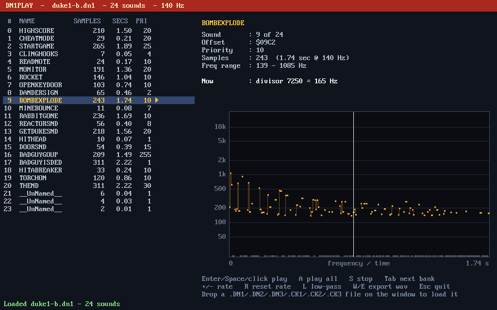
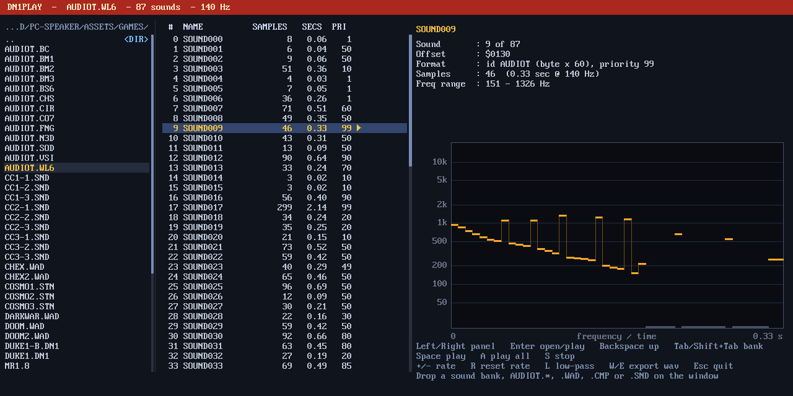
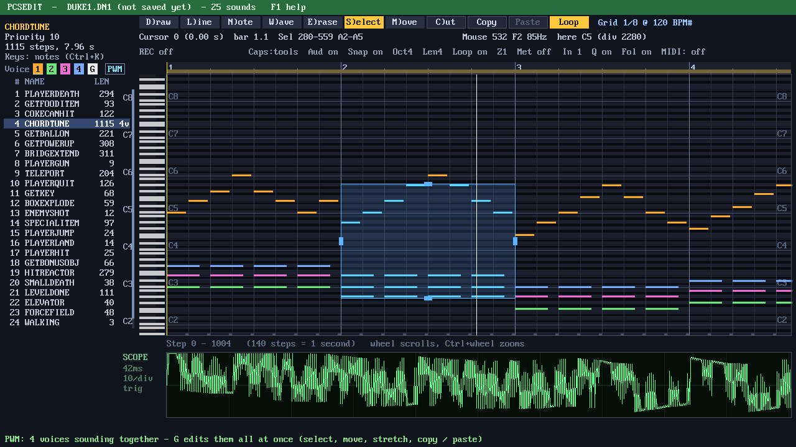
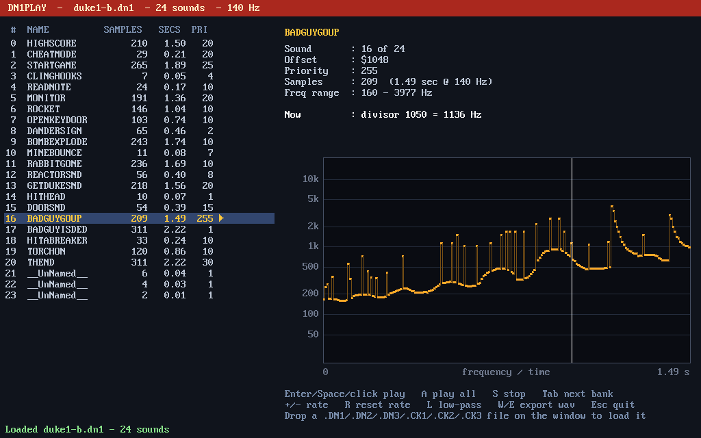
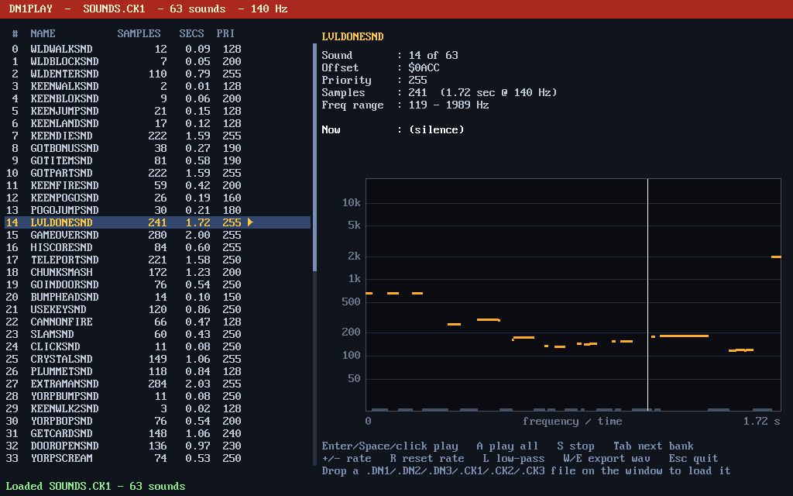
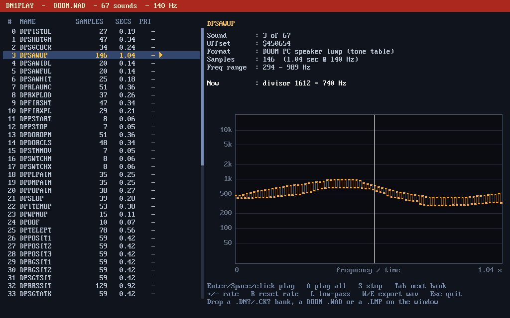
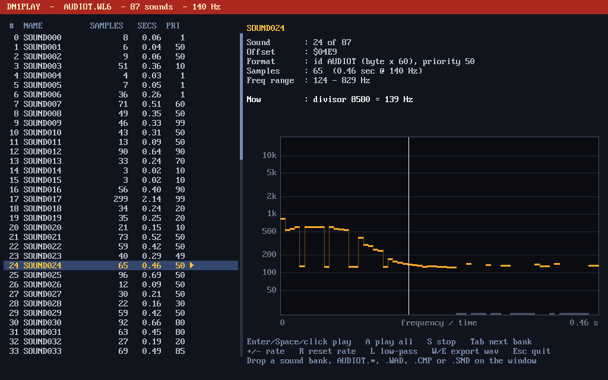

# PC-SPEAKER: the DOS PC speaker, rebuilt in QB64-PE

**Short version:** this folder plays old-school PC speaker sound effects in
QB64-PE on a modern computer: **Duke Nukem 1 and 2**, **Commander Keen**,
**Wolfenstein 3D**, **Spear of Destiny**, **Blake Stone**, **Cosmo**,
**Crystal Caves**, **DOOM**, **Rise of the Triad** and more (see
[Supported games](#supported-games)). It is written entirely in QB64-PE, with
no C and no `DECLARE LIBRARY`.



It is a port of the Borland C++ code from **NCOT Technology's** video about
programming the PC speaker under MS-DOS. The original code is at
[ncot-tech/pc-speaker](https://github.com/ncot-tech/pc-speaker), with a copy at
[grymmjack/ncot-pc-speaker](https://github.com/grymmjack/ncot-pc-speaker).

**📺 Video:** [https://youtu.be/bH8UITZadf4](https://youtu.be/bH8UITZadf4).
Every C program in the video has a QB64-PE version here. See
[Follow along with the video](#follow-along-with-the-video) for which file
goes with which part.

Built and tested with the QB64-PE **v4.7.0-GLFW** compiler.

---

## Quick start

1. Open **`DN1PLAY.BAS`** in QB64-PE.
2. Press **F5**.
3. Use the arrow keys to pick a sound, then press **Enter** to hear it.
4. Press **A** to play every sound in order.
5. Press **Left** to move to the file browser on the left. Pick the `GAMES`
   folder with Enter, then any file with Enter to load it. **Tab** /
   **Shift+Tab** load the next / previous file without leaving the sound list.
6. Press **Right** to go back to the sound list.



The window has three parts. On the left is a file browser that works like an
old DOS "open file" box: it starts in the loaded bank's folder and lists `..`,
the sub folders (`<DIR>`) and every file DN1PLAY can load. The loaded file is
shown in yellow. In the middle is the list of sounds in the bank. On the right
are the details and graph for the selected sound. The highlighted panel is
the one the arrow keys move in.

| Key | What it does |
| --- | --- |
| Left / Right | move between the file browser and the sound list |
| Up / Down / PgUp / PgDn / Home / End, mouse wheel | move in that panel |
| Enter / mouse click | browser: open the folder or load the file; sound list: play the sound |
| Space | play the selected sound |
| Backspace | browser: go up one folder |
| A | play everything, starting at the selected sound (press A again to stop) |
| S | stop |
| + / - | speed the sound up or slow it down by 5 Hz |
| R | reset the speed to 140 Hz |
| L | low-pass filter on/off (muffles the sound like a small speaker) |
| W | save the selected sound as a `.wav` in `EXPORT/` |
| E | save every sound as a `.wav` in `EXPORT/` |
| Tab / Shift+Tab | load the next / previous file in the browser's folder |
| Esc | quit |

You can also drag any file from the [Supported games](#supported-games) table
onto the window, or pass one on the command line:
`DN1PLAY ~/games/wolf3d/AUDIOT.WL6` or `DN1PLAY ~/games/doom/DOOM2.WAD`.

---

## PCSEDIT: make your own sounds

**`PCSEDIT.BAS`** is an editor for PC speaker sound effects. A sound is a list
of steps, 140 per second, and each step is a pitch or silence, which is exactly
what the games stored. You can draw a sound with the mouse, or play it in on
the computer keyboard or a MIDI keyboard. It saves IFS banks (the Duke Nukem 1
/ Commander Keen format), which DN1PLAY and `PCSPKR.BM` play. It can open any
file from [Supported games](#supported-games), so you can take a sound from
Wolfenstein 3D or DOOM, change it, and save it as your own.



**Tools:** the big panel is a piano roll, with pitch going up and time going
right. The toolbar above it picks a tool. Click a button, press its letter
(with **Caps Lock off**), press **Alt+letter** (always works), or press **Tab**
/ **Shift+Tab** to cycle. Right-drag erases with any tool.

| Tool | What it does |
| --- | --- |
| **D**raw | freehand: every step follows the mouse, for sweeps and zaps. **Shift+click** draws a straight line from the last point (slides). |
| **L**ine | press, drag and release to draw a straight line of steps, like a pixel-art line tool, with a rubber-band preview. With snap on it becomes a staircase of semitones. |
| **N**ote | the default. **Click** to place a steady note at that pitch, **Len** long (**F11/F12**; counted in grid cells while the grid is on). Drag right to make it longer; the pitch stays where you clicked. A grey bar shows what a click would place. |
| **W**ave | drag a box to fill it with a pitch waveform: the box's width is how long it lasts and its height is the pitch range it swings between. While the box is still live (pink), press **1** square, **2** triangle, **3** saw up, **4** saw down or **5** sine. **[ ]** give fewer or more cycles. Drag inside the box left/right for the **duty cycle** and up/down for the **phase**. Drag the box's **edges** to resize it: left/right stretch or squash it in time (the cycles stretch with it), top/bottom move the top or bottom of its pitch swing (past the other edge, it turns upside down). Press Enter, click outside the box or pick another tool to finish; Esc cancels. |
| **E**rase | drag to clear steps |
| **S**elect | drag a box around steps. With the grid and snap (F6) on, its ends snap to whole grid cells; hold **Alt** while dragging for exact steps. With the grid off, **Shift** snaps it to whole beats. Rests inside the box are part of the selection, so a bar or a phrase moves, copies and pastes as one chunk, silences and all. **Ctrl+A** selects the whole sound. |
| **M**ove | drag the selection. Time moves in whole cells with the grid and snap on (hold **Alt** for single steps), otherwise in steps; pitch in semitones. Stretching the box's edges snaps the same way. |
| **C**ut, Copy, Paste | **C** or **Ctrl+X** cuts, **Ctrl+C** copies, and **Ctrl+V** pastes at the cursor. Pasted steps become the selection, ready to move. |

The mouse wheel scrolls, and **Ctrl+wheel** zooms around the mouse pointer:
from 64 pixels a step (about 15 steps on screen) out to a tenth of a pixel
a step (about 70 seconds, or 36 bars at 120 BPM). The time ruler and bar
numbers thin out as you zoom out, so they stay readable.
Click the time ruler above the roll to move the cursor (the yellow line).

**Waveforms** shape the pitch, not the sound itself: the speaker always plays a
square wave. A square wave is a trill between two pitches, a triangle or sine is a
siren or vibrato, and a saw up is the classic rising zap. Duty sets where the
shape turns. For a square it is the share of each cycle spent on the high
pitch. For a triangle or sine it is where the peak falls (50% is symmetrical).
For a saw it is how much of the cycle the ramp takes (100% is a plain saw).
With the grid on, the box snaps to cells; with snap on, the pitches snap to
semitones (switch snap off with F6 for smooth slides).

**Window and display scale:** the window can be resized or maximised. The
piano roll and scope take the extra width (more time on screen), the note
rows get taller, and the sound list shows more sounds. **Ctrl+=** / **Ctrl+-**
change the display scale from 50% to 300% (**Ctrl+0** = 100%). Bigger makes
text and controls easier to read on a large screen; smaller fits more in. If
the window is too small for a scale, PCSEDIT says so; make the window bigger
and try again.

PCSEDIT **remembers** the window size, position and display scale, plus your
working settings (grid and tempo, metronome mode and volume, count-in,
quantize, follow, loop, grid lines, audition, snap, octave, note length,
zoom, key zoom and ARP/PWM) and **the last folders you used**: the open, save
and import dialogs start in the folder of the last bank you opened, saved
or imported, and Ctrl+E in the folder of the last export. They are saved when you quit, to `~/.config/pcsedit.ini`
(`%APPDATA%\PCSEDIT.ini` on Windows), a plain `key=value` text file. Delete it
to go back to the defaults.

**Zooming the keys:** **Shift+wheel** makes the note rows taller or
shorter: every note in view (as it starts), then 6, 5, 4, 3, 2 octaves, down
to a single octave. The note under the mouse stays put. Zoomed in:

* the wheel over the piano keys scrolls up and down through the notes, and a
  thin scrollbar appears left of the keys while you scroll, zoom or point at
  the keys (drag it, or click above or below its thumb to jump);
* the keys show their names (C4, F#4, ...) once there is room, and note bars
  grow thicker and show their note names when they're long enough.

**Zoom to fit:** double click the piano keys to fit the notes in view (the
selection's, or every note of the sound in all voices). Double click the
time ruler to fit the length (the selection, or the whole sound). A middle
click on the roll does both.

The zoom and the notes in view are remembered between sessions.

**Reading the roll:** white-key rows are lighter and black-key rows darker, like
a piano roll. Every C has a brighter octave line, labelled at both edges of the
grid. While a key is held (computer keyboard, MIDI or the piano keys), its row
lights up across the grid and the title bar shows **KEY**, the note, its
frequency and its PIT divisor.

**Oscilloscope:** the panel under the roll is always on. It shows what the
emulated speaker is putting out right now, after the speaker-cone filter: the
real 1-bit square wave, about 42 ms of it, triggered on a rising edge like a
real scope, so a steady note holds still. Play a sound, hold a note, or play
the instrument, and you see each pitch change as the wave's cycles get wider
or narrower. The slight slope on the flat parts is the cone's filter; a real
PC speaker droops the same way.

**Fine pitch:** the mouse places pitches about 1/6 of a semitone apart, and
snap places them on whole semitones. To go finer, select the steps and press
**Alt+Up/Down**. That moves each one by a single PIT divisor, the smallest
pitch change the hardware (and the file) can make: about 0.6 cents at 440 Hz.
The info line shows the divisor under the mouse.

Sounds always use the games' 140 steps per second. That is what Duke Nukem,
Keen, Wolfenstein 3D and DOOM played, so every bank PCSEDIT saves works in
the same players the originals did.

**Stretching a selection:** with the Select or Move tool, the selection box
has a handle on each edge, and the one under the pointer lights up.

* Drag the **left or right** edge to stretch or squash the selection in time.
  The other edge stays put, and with the grid on, edges snap to grid cells.
* Drag the **top or bottom** edge to stretch or squash its pitch range. The
  other edge stays put, and every pitch keeps its place within the range: a
  run of semitones stretched twice as tall becomes whole tones. Drag past the
  other edge and the passage turns upside down.
* **Ctrl+Up** makes the selection twice as long and **Ctrl+Down** half as
  long, from its start. Without a selection, Ctrl+Up/Down still transpose the
  whole sound.

Rests stretch along with the notes, so rhythm is kept. A stretched selection
writes over whatever was under its new area; Ctrl+Z undoes each stretch.

With a selection, the **arrow keys** nudge it (**Shift+Up/Down** moves it an
octave), **Delete** clears it, and **Esc** deselects. All of it can be undone.

**Caps Lock** decides what the letter keys do. With Caps Lock **on**, the
computer keyboard is a piano (see below). With it **off**, the letters pick
tools.

**What the dots are:** a sound is one pitch every 1/140 of a second, so
each dot on the roll is one step. There are no note lengths, ties or curves in
the file, only that list of pitches. A long note is a row of dots at the same
pitch, and a slide is a staircase of dots. The thin lines between dots, here
and in DN1PLAY's graph, are only drawn to join two sounding steps in a row so
you can follow the shape; silence breaks them. To make a slide, draw it, or
Shift+click to get a straight line from the last point.

**Musical grid:** **Ctrl+G** steps through the grid sizes: off, 1/4, 1/8,
1/16, 1/32, 1/64, 1/128, then 1/8 and 1/16 triplets (**Ctrl+Shift+G** goes back). **Ctrl+B**
sets the tempo, which starts at 120 BPM. When the sound already has notes, a new tempo asks
whether to retime them: **Yes** speeds the notes up or slows them down to
the new tempo (every voice; the selection, loop region and cursor go along;
Ctrl+Z undoes it), **No** changes only the grid, **Cancel** keeps the old
tempo. With the grid on:

* the roll shows a line for every cell, a stronger one for every beat, and a
  numbered line for every bar (4/4), and the cursor shows *bar.beat*;
* with snap on (**F6**), everything you place in time lands on grid lines:
  drawing, erasing, Line, Note, Wave boxes, selections, moving, stretching,
  nudging with Left/Right, pasting and clicking the cursor in the ruler.
  Hold **Alt** while dragging (or with the arrows / Ctrl+V) to place by
  single steps instead;
* drawing and erasing fill whole cells, with one pitch per cell, so a dragged
  sweep turns into a staircase of notes;
* Left/Right move the cursor a cell at a time and Ctrl+Left/Right a beat at a
  time, and in STEP record **Len** counts cells instead of steps.

The sound still plays at 140 steps a second, so a cell is often not a whole
number of steps: a 1/16 at 120 BPM is 17.5. Each cell starts on the nearest
step, so cells come out 18 and 17 steps long in turn and the notes stay in
time. A very fine grid at a fast tempo can get down to one or two steps a
cell. The tempo and grid aren't saved in the bank, because the IFS format has
nowhere to store them.

**Playing notes in:** with **Caps Lock on**, the computer keyboard is a
two-octave piano, laid out like a tracker:

```
 2 3   5 6 7          S D   G H J
Q W E R T Y U I      Z X C V B N M ,     (Z = C, F9/F10 change octave)
```

A MIDI keyboard works too. PCSEDIT finds it at start-up, and **F7** switches
to another device or turns MIDI off. You can also **click and hold the piano
keys** left of the roll to hear a pitch, and drag up and down to slide; that
never records. Notes always sound while you hold them. **F5** picks what
they do:

* **REC off:** the notes just play.
* **STEP:** each note writes *Len* steps at the cursor and moves the cursor on,
  like a tracker. **F11/F12** set *Len*.
* **LIVE:** records what you play, 140 steps a second, starting with your first
  note. **F5** or **Space** stops it, and the silence after your last note is
  trimmed off. The PC speaker plays one note at a time, so the note you pressed
  last wins.

**Recording with a metronome:** **Ctrl+R** starts a LIVE recording at the
cursor straight away, after a **count-in** of 1 bar (**Ctrl+U** cycles off / 1
/ 2 bars). The **metronome** clicks on every beat, with a higher click on
the first beat of each bar, lined up with the grid's bars. **Ctrl+M** cycles
it: off / **REC** (while recording) / **R+P** (while recording and playing
back). **Ctrl+Shift+M** sets its volume. The clicks are a separate sound mixed in alongside the
speaker, so they are never recorded. F5's LIVE mode still waits for your first
note and starts recording there, with the metronome from then on.

**Quantize** (**Ctrl+Q**, on by default): every LIVE note snaps to the grid as
you play. Each note's start moves to the nearest grid cell and its end to the
nearest cell edge (at least one cell long), and the take is re-drawn straight
away. Notes are timed by what you *heard*, so the audio running a little
ahead doesn't make you late. It works for plain notes and for instrument mode
(Ctrl+K): each instrument note plays the sound from its quantized start, cut
at its quantized release (GATE) or played in full (ONE-SHOT). If the grid is
off when you start recording, it is set to 1/16.

**Loop** (**Ctrl+L**, or the **Loop** button on the toolbar, which lights up
when it's on) repeats, in order of priority:

1. the **selection's** time span, when something is selected;
2. the **loop region**: drag in the time ruler above the roll to make one.
   It shows as an orange band with brackets down the roll, and turns Loop on.
   Its ends snap to grid cells with the grid on, or to **whole bars with
   Shift**. Drag either end to adjust it, **right-click** the ruler to clear
   it. A plain click in the ruler still just moves the cursor. A region can
   run past the end of the sound; the rest plays as silence;
3. otherwise, the whole sound.

Space starts inside whatever is looping. The metronome starts over from
beat 1 each time round.

**Chords: voices, ARP and PWM.** The speaker can only play one square wave at
a time, so the games are monophonic. PCSEDIT gives each sound up to **4
voices** and two ways to hear them together:

* **Voices:** **Ctrl+1** to **Ctrl+4**, or the **Voice 1 2 3 4** chips above
  the sound list, pick the voice you edit. Every tool, recording and
  selection works on that voice. The other voices show dimmed in their own
  colours (green, pink, blue), and the list marks multi-voice sounds (`3v`).
* **G, all voices at once:** **Ctrl+5** or the **G** chip. Then every
  voice shows bright, and select, move, stretch, cut / copy / paste, Delete,
  fine pitch, transpose, insert / delete step and trim act on all of them, so
  chords move as one. The eraser takes the notes near the pointer, in any
  voice, so you can remove a single chord note. The **Note** tool puts each
  note in a voice that is free there, so clicking notes above each other
  builds a chord. Draw, Line and Wave still draw in the voice whose chip is
  underlined. Picking a voice (Ctrl+1-4) leaves G.
* **M / S / R** buttons sit under each voice chip:
  * **M** mutes the voice: it isn't heard when the sound plays, loops or is
    exported (Ctrl+E). Saving keeps it. Muted notes are faded in the roll.
  * **S** solos it: the other voices are muted. **S** on another voice while
    one is soloed adds that voice too, and from then on it is just mutes
    (the S light goes out, M changes them). **S** on the soloed voice again
    puts the mutes back as they were.
  * **R** arms the voice for recording. With voices armed, recording plain
    notes (computer keys or MIDI, STEP or LIVE, quantized or not) spreads
    chords over the armed voices only: arm 2, 3 and 4 and a triad goes into
    those three, leaving the melody in voice 1 alone. Each key takes the
    first free armed voice; more keys than armed voices are left out. With
    nothing armed, recording goes into the voice you are editing, as before.
* **ARP speed:** the small box under the ARP / PWM chip (click it, use the
  wheel on it, or **Ctrl+Shift+J**) sets how many steps each chord note
  lasts before the next one takes over: 1 (a buzzy blur at 140 notes a
  second), 2, 3 (the default), 4, 6, 8, 12 or 16 (a slow, clear arpeggio). The ARP
  version saved in the bank uses it too, so games play it the same way.
* **Vol** (PWM mode): a fader per voice, 0 at the bottom, 100% at the line
  in the middle, 200% at the top. Click or drag in it to set the level, use
  the wheel on it, or double click it for 100%. While a sound plays, each
  fader lights up when its voice is sounding. A 1-bit speaker can only get
  quieter or louder through PWM, so the levels do nothing in ARP mode. In
  PWM the voices share the speaker's swing evenly, which is clean at 100%;
  turning a voice up past 100% brings it forward but can clip.
* **Master volume:** the tall fader under **G** sets the level of
  everything you hear: ARP or PWM, the keys, and Ctrl+E exports (100% is
  the middle line, up to 200%).
* **Middle click** on any M, S or R button clears all of them (every mute,
  the solo, and every record arm); on any fader, it puts every fader back to
  100%.
* **Chords from the keys:** in STEP record, hold a note and press more. The
  first note goes in the voice you're editing and the others go in the next
  voices, at the same steps.
* **ARP** (the default): the voices take turns, one step each. That's the
  classic fast-arpeggio fake chord, it is what the games could really do,
  and it is what gets saved.
* **PWM** (**Ctrl+J**, or click the mode chip): the voices really sound at
  once. PCSEDIT sends the speaker a 15.7 kHz stream of pulses whose width
  follows how many voices are "high" at each moment, the same trick
  `WAV.BAS` uses for recorded sound. Held chords, playback, Ctrl+E export and
  a multi-voice sound played on the keys with **Ctrl+K** all use it. It is too heavy for the games' 140 Hz timer, so it never goes
  into the bank.

**Saving a sound with voices:** the bank holds the ARP mix under the sound's
name, so DN1PLAY and the games play it. It also holds one `NAME~1` ...
`NAME~4` entry per voice, so PCSEDIT can split the voices apart again when
the bank is opened. The game would see those as extra sounds, and they cost
space in the 64 KB limit.

**Glide (pitch slides):** **Ctrl+I** sets how long a slide between two
notes takes: off, 2, 3, 4, 6, 8, 12, 16, 24 or 35 steps (35 steps is a
quarter of a second). The status line shows it as **Glide**. With glide on:

* playing the keys is legato: press a key while another is still down and
  the pitch slides from the old note to the new one, like a synth's
  portamento (so held chords are off while glide is on). LIVE recording
  writes the slide just as you hear it, and a quantized take gets its slides
  back after the notes are snapped;
* in STEP record, a note entered straight after another slides in from it;
* **Ctrl+Shift+I** glides the selection (or the whole voice; with **G**,
  every voice): wherever one note goes straight into another, the new note's
  first steps slide over from the old pitch. Slides you drew, vibrato and
  rests are left alone, and Ctrl+Z undoes it.

**Vibrato:** **Ctrl+W** picks one: off, light, normal, wide, fast or slow
(each a depth and a speed; the status line shows it as **Vib**). A note
starts steady and the vibrato fades in after 0.1 s, the way a singer or a
violin does it. With vibrato on, held keys wobble and STEP / LIVE record it;
**Ctrl+Shift+W** puts it on every note in the selection (or the whole voice;
with **G**, every voice) that is long enough, leaving slides alone. Glide
and vibrato work together: the slide first, then the wobble.

Slides and vibrato are just runs of steps whose pitch moves a little each
1/140 s, the same as a sweep drawn with the Line tool, so games play them
exactly as you hear them.

**Follow** (**Ctrl+F**, on by default): while playing, the view pages along
with the playhead so it never runs off the right edge.

**Hear what you draw:** with **A** on (the default), the Draw, Line, Note,
Wave and Move tools play the step under the pointer while the mouse button
is down, so you hear pitches as you place them. Press **A** again for silent
drawing.

**Playing a sound as an instrument:** by default a key plays a plain tone.
Press **Ctrl+K** and the keys play *the selected sound* instead: every note
plays the whole sound, transposed, the way a sampler does. C4 plays it as
drawn, C5 an octave higher, and so on. That turns a sound you have drawn (a
zap, a blip, a little arpeggio) into an instrument you can play tunes with.

* The instrument is marked with ♪ in the list. It **follows the sound you
  pick**: press Up/Down or click another sound and the keys play that one.
  Pressing **Ctrl+K** again goes back to plain notes.
* **Ctrl+Shift+K** locks the instrument to the sound it's on now, so you can
  pick other sounds without changing what the keys play. The Keys line shows
  **LOCK**; press Ctrl+Shift+K again to unlock it.
* **Ctrl+H** sets how a note plays it: **GATE** sounds while the key is held,
  **ONE-SHOT** always plays to the end, and **LOOP** repeats while the key is
  held.
* **STEP** and **LIVE** record what you play *into another sound*, never into
  the instrument. If the instrument is the selected sound when you start, a
  new sound called `<name>_TUNE` is made to record into, and the instrument
  locks so you can keep working in the tune. In STEP, each note
  writes the instrument as if the key was held for *Len*; ONE-SHOT writes the
  whole sound.
* An instrument with **several voices** (a chord, say) plays with PWM when
  the mode is PWM (**Ctrl+J**), so its notes really sound together, even
  while recording. Recording keeps its voices apart: the instrument's voice
  1 goes into voice 1 of the tune, voice 2 into voice 2, and so on. The tune
  plays back as PWM or ARP like any other multi-voice sound.

| Key | What it does |
| --- | --- |
| Space / Enter | play from the start / from the cursor (Ctrl+L loops) |
| Ctrl+1 ... Ctrl+4 / Ctrl+5 / Ctrl+J | edit voice 1-4 / G: all voices / chords as ARP or PWM |
| Left / Right | move the cursor a step (a grid cell with the grid on); Ctrl: a beat, or 0.1 s with the grid off. With a selection they nudge it instead. |
| Home / End | cursor to the start / end of the sound |
| PageUp / PageDown | previous / next dot (where a new pitch starts); with the NOTE tool, previous / next bar |
| Up / Down, Ctrl+PageUp / PageDown | previous / next sound in the bank |
| Insert / Delete / Backspace | insert a step, delete a step, delete the step before the cursor |
| Ctrl+Up / Ctrl+Down | with a selection: twice / half as long; without: transpose the sound a semitone (add Shift for an octave) |
| Ctrl+G / Ctrl+Shift+G | grid size: off, 1/4, 1/8, 1/16, 1/32, 1/64, 1/128, 1/8T, 1/16T |
| Ctrl+B | tempo (BPM) for the grid, the metronome and the count-in |
| Ctrl+R | LIVE record from the cursor now, after the count-in |
| Ctrl+M / Ctrl+Shift+M | metronome off / while recording / recording + playback; click volume |
| Ctrl+F | follow the playhead while playing |
| Ctrl+= / Ctrl+- / Ctrl+0 | display scale bigger / smaller / 100% |
| Ctrl+U | count-in: off, 1 bar, 2 bars |
| Ctrl+Q | quantize LIVE notes to the grid |
| A | hear what you draw while the mouse button is down |
| ' (apostrophe) | grid lines on/off: a line between every note row and at every grid cell (with the grid off: every step, when zoomed in). Off leaves just beats and bars. A # after the grid label means they are on. |
| Ctrl+K / Ctrl+Shift+K / Ctrl+H | keys play notes or the selected sound / lock the instrument / GATE, ONE-SHOT, LOOP |
| D L N W E S M (Caps Lock off), Alt+letter, Tab | tools: Draw, Line, Note, Wave, Erase, Select, Move |
| 1-5, [ ] (WAVE tool, Caps Lock off) | waveform shape (square, triangle, saw up, saw down, sine), fewer / more cycles |
| C / Ctrl+X, Ctrl+C, Ctrl+V, Ctrl+A | cut, copy, paste at the cursor, select all |
| Arrows / Delete / Esc (with a selection) | nudge it (Shift+Up/Down = octave, Alt+Up/Down = one PIT divisor) / clear it / deselect |
| Caps Lock | on = the keyboard plays notes, off = letters pick tools |
| Ctrl+T | trim silence off the end |
| Ctrl+Z / Ctrl+Y | undo / redo |
| F2 / F3 / F4 / F8 | rename, new sound, duplicate, delete (press F8 twice) |
| Ctrl+P | set the sound's priority |
| Ctrl+N / Ctrl+O / Ctrl+S / Ctrl+Shift+S | new bank, open (a `.mid` or `.mml` is imported as a new sound), save, save as |
| Ctrl+Shift+V | import a QB64 PLAY string from the clipboard as a new sound |
| Ctrl+E | export the sound as a `.wav` in `EXPORT/` |
| F1 | help |

Opening, saving, exporting, renaming and setting the priority or tempo use
QB64-PE's native dialogs (`_OPENFILEDIALOG$`, `_SAVEFILEDIALOG$`,
`_INPUTBOX$`, `_MESSAGEBOX`), which use kdialog or zenity on Linux. With unsaved
changes, quitting, starting a new bank or opening another file asks **Save /
Don't save / Cancel**. Ctrl+E asks where to save the `.wav`, starting in
`EXPORT/`.

The first save after opening a file always asks for a name, and suggests
`<name>-EDIT.SND`, so a game's own file is never overwritten by accident. An
IFS bank stores its offsets as 16-bit numbers, so a bank has to stay under
64 KB, which is about 4 minutes of sound in total.

**How MIDI works without `DECLARE LIBRARY`:** QB64 can't read a device
without stopping the program until data arrives. PCSEDIT starts ALSA's `amidi`
in the background (`amidi -p hw:4,0,0 -r /tmp/pcsedit-midi-....raw`), which
writes the keyboard's bytes to a temp file. The editor reads anything new in
that file every frame. When PCSEDIT quits, it stops `amidi` and deletes the
file. This needs Linux, the `alsa-utils` package, and your user in the `audio`
group. On other systems, use the computer keyboard.

**Importing MIDI files, modules and PLAY music:** open (**Ctrl+O**) or drop
a `.mid`, `.mod` or `.mml` file, or copy a QB64 `PLAY` string (or a whole `PLAY "..."` line
from a program) and press **Ctrl+Shift+V**. It is added to the bank as a new
sound, with its notes spread over the 4 voices.
Its melody usually goes to voice 1. If more than 4 notes play at once, the
extra ones are left out, and the drums (channel 10) are skipped. For more
control (channels, transposing, a single-voice version for a game) use
`MID2SND`, below.

---

## MID2SND: MIDI files, PLAY music and .mod files to PC speaker banks

`MID2SND.BAS` is a command-line converter. It turns a MIDI file, QB64
`PLAY` music (MML), or a ProTracker `.mod`, into one
sound with up to 4 voices, saved the way PCSEDIT saves voices (see
[Chords](#pcsedit-make-your-own-sounds)). The bank holds the ARP mix that
DN1PLAY and the games can play, plus the separate voices for PCSEDIT, which
can play them together in PWM mode.

```
qb64pe -x MID2SND.BAS
./MID2SND song.mid -i                 # what's in it: channels, notes, length
./MID2SND song.mid                    # -> song.snd, 4 voices
./MID2SND song.mid tune.snd -v 1      # 1 voice: the top note only, for a game
./MID2SND song.mid tunes.snd -a -n THEME -c 1,2 -t -12 -s 30
./MID2SND tune.mml                    # QB64 PLAY strings in a text file
./MID2SND -p "T160 O2 L8 CDEFGAB>C" scale.snd
./MID2SND song.mod -i                 # a .mod: its channels and samples
./MID2SND song.mod tune.snd -x 2,5 -s 40   # without samples 2 and 5, the first 40 s
```

| Option | What it does |
| --- | --- |
| `-v N` | voices, 1 to 4 (default 4). `-v 1` keeps the highest note at every moment, a melody line a game can play as-is. |
| `-t N` | transpose by N semitones |
| `-c LIST` | MIDI channels to use, like `-c 1,2,4` (default: all but the drums on 10) |
| `-n NAME` | the sound's name, up to 10 letters (default: from the file name) |
| `-a` | add the sound to the bank instead of replacing the file. A sound with the same name is replaced. |
| `-s SECS` | stop after SECS seconds |
| `-g` | no one-step rest between repeated notes of the same pitch (by default there is one, so they don't run together into one long note) |
| `-p MML` | convert this PLAY string instead of a file |
| `-x LIST` | `.mod`: leave these samples out, like `-x 2,5` (drums, usually) |
| `-r N` | ARP speed for the mix: each chord note lasts N steps (default 3) |
| `-i` | list the file's channels, notes, length and the most notes at once |

### PLAY strings (MML)

QB64's `PLAY` statement takes *Music Macro Language*. MID2SND and PCSEDIT
read it the way QB64-PE's own `PLAY` does (its `audio.cpp`), so a string
sounds at the same pitches and speed:

* notes `A`-`G` with `#`/`+` (sharp) or `-` (flat), a length (`C8`) and dots;
  `N0`-`N84` by number; rests `P`/`R`;
* `O0`-`O6`, `<` `>`, `L`, `T`, and `MN` / `ML` / `MS` (a note sounds 7/8,
  all, or 3/4 of its length). In QB64-PE, **`O2 C` is middle C** and `O4 A`,
  the default octave, is 1760 Hz;
* QB64-PE's **commas**: a comma after a note plays the next note with it,
  so `"L2 C,E,G"` is a chord;
* QB64-PE's **multi-voice PLAY**: `PLAY a$, b$, c$, d$` plays four voices at
  once. Each string becomes a voice.

Volume, waveform, envelope and panning commands (`V W @ Q / \ ^ _ Y S`) are
skipped, because the speaker has none of them. `X` + `VARPTR$` can't be
followed.

A `.mml` file is plain text. Each line is one of:

```
' a comment (or # ...)
PLAY "T132 O2 L8 CDEFG", "T132 O1 L2 C,E"   ' pasted from a program: one voice per string
V2: O1 L4 CGCG                              ' more for voice 2 (V1: to V4:)
T120 O2 L4 CDE                              ' anything else: more for voice 1
```

Lines for the same voice are joined, so a long tune can span many lines.
`ASSETS/TUNES/PLAYDEMO.mml` is a short 3-voice example.

### Tracker modules (`.mod`)

ProTracker, NoiseTracker and SoundTracker modules (4, 6, 8 or more
channels, and the old 15-sample kind) are read as they play:

* speed and tempo changes (`Fxx`), pattern breaks (`Dxx`) and position
  jumps (`Bxx`). A jump back to an earlier position is the song looping, so
  the conversion ends there;
* each channel's note lasts until its next note, a note cut (`ECx`) or
  volume 0 (`C00`). A sample that doesn't loop (drum hits, plucks) ends its
  note when the sample would run out; note delays (`EDx`) are followed;
* arpeggios (`0xy`), the classic tracker chord, become notes a tick long
  cycling through the chord, which is just what a PC speaker game does;
* ProTracker's C-2 (period 428) is middle C. Slides, vibrato and volume
  effects are not converted. Use PCSEDIT's glide and vibrato afterwards if
  you like.

Drums turn into short beeps. `-i` lists every sample with its length,
whether it loops, and how many notes it plays, so you can spot the drums
(short, played a lot, usually not looping) and leave them out with `-x`.
Most modules are longer than a 4-voice bank holds (about 46 s): use `-s` for
an excerpt, or `-v 1` for the tune's top line, which fits over 3 minutes.
PCSEDIT opens `.mod` files too (Ctrl+O or drop one), as up to 64 s in a new
sound. XM, S3M and IT modules are different formats and aren't read yet.

### How notes become voices

Tempo changes are followed, and the tune starts at its first note. Notes are
given to voices top note first. Each note goes to the free voice whose last
note was nearest in pitch, so a melody tends to stay in voice 1.

An IFS bank holds 64 KB, and every step costs 2 bytes per voice plus 2 for
the mix. That's about **46 seconds with 4 voices**, a minute with 3, and over
3 minutes with 1. MID2SND says so when a tune doesn't fit.

### Example tunes (`ASSETS/TUNES/`)

Open any of these in PCSEDIT. Press **Ctrl+J** for PWM to hear the voices
together, or play them in DN1PLAY to hear the ARP version the games would
play.

| Bank | Tune |
| --- | --- |
| `ODETOJOY.SND` | Ode to Joy (Beethoven) |
| `FURELISE.SND` | Für Elise, the opening (Beethoven) |
| `KOROBEINIK.SND` | Korobeiniki, the Tetris theme (Russian folk song) |
| `GREENSLEEV.SND` | Greensleeves (English, 16th century) |
| `MINUETG.SND` | Minuet in G (Petzold, from the Notebook for Anna Magdalena Bach) |
| `CANOND.SND` | Canon in D (Pachelbel) |
| `MTNKING.SND` | In the Hall of the Mountain King (Grieg), speeding up as it goes |
| `BIRTHDAY.SND` | Happy Birthday |
| `JINGLEBELL.SND` | Jingle Bells, the chorus |
| `CHIPLOOP.SND` | an original chiptune loop |
| `JINGLES.SND` | three original game jingles: FANFARE, LEVELUP, GAMEOVER |
| `PLAYDEMO.SND` | an original march, written as QB64 PLAY strings in `PLAYDEMO.mml` |

`MOD-CONVERSIONS/` holds 18 tracker modules by 4-Mat, XTD, Jester,
Heatbeat, Dr. Awesome and Dubmood converted the same way (credits in its
README).

They are all public domain or written for this project. The arrangements are
in `make_tunes.py` as plain note lists, so they are easy to change or add to.
`make_tunes.sh` writes the MIDI files (`ASSETS/TUNES/MIDI/`) and runs
MID2SND on each one.

---

## Supported games

Browse to **`ASSETS/GAMES/`** in DN1PLAY and load any file there. The file
type is worked out from its contents, not its name. The sound counts come from
an eXoDOS collection.

Only the shareware episode 1 and freeware files in that folder are committed:
Keen 1, Duke 1, Cosmo 1, Major Stryker 1, Math Rescue 1, Crystal Caves 1 and
Bio Menace. The other files are listed in `ASSETS/GAMES/.gitignore`, so
copies you add yourself stay on your machine.
[`ASSETS/GAMES/README.md`](ASSETS/GAMES/README.md) says what each file is and
whether it can be passed on.

| Game | File to load | Sounds | Format |
| --- | --- | --- | --- |
| Duke Nukem 1 | `DUKE1.DN1`, `DUKE1-B.DN1` | 24 + 24 | IFS bank |
| Commander Keen 1 | `SOUNDS.CK1` | 63 | IFS bank |
| Cosmo's Cosmic Adventure | `COSMO1.STN` (2, 3) | 72 | IFS banks inside the file |
| Major Stryker | `VOLUME1A.MS1` (2, 3) | 48 | IFS banks inside the file |
| Hovertank 3-D | `SOUNDS.HOV` | 24 | IFS bank |
| Rescue Rover | `SOUNDS.ROV` | 24 | IFS bank |
| Catacomb II | `SOUNDS.CA2` | 63 | IFS bank |
| Slordax | `SOUNDS.SLO` | 63 | IFS bank |
| Math Rescue | `MR1.8` (2, 3) | 24 | IFS bank |
| Wolfenstein 3D | `AUDIOT.WL6` (or `.WL1`) | 87 | id AUDIOT |
| Spear of Destiny | `AUDIOT.SOD` | 81 | id AUDIOT |
| Blake Stone: Aliens of Gold | `AUDIOT.BS6` | 100 | id AUDIOT |
| Blake Stone: Planet Strike | `AUDIOT.VSI` | 100 | id AUDIOT |
| Corridor 7 | `AUDIOT.CO7` | 100 | id AUDIOT |
| Operation Body Count | `AUDIOT.BC` | 100 | id AUDIOT |
| Bio Menace | `AUDIOT.BM1` (2, 3) | 42 | id AUDIOT |
| Super Noah's Ark 3-D | `AUDIOT.N3D` | 44 | id AUDIOT |
| Cyberchess, Finagle, Circuitry | `AUDIOT.*` | 11, 6, 7 | id AUDIOT |
| Duke Nukem II | `NUKEM2.CMP` | 34 | id AUDIOT inside the archive |
| Crystal Caves | `CC1-1.SND` (and the other `CC?-?.SND`) | 12 per file | raw divisors |
| DOOM, DOOM II, Final DOOM | `DOOM.WAD`, `DOOM2.WAD`, `TNT.WAD`, `PLUTONIA.WAD` | 67 / 107 | DOOM lumps |
| Chex Quest, Freedoom | `CHEX.WAD`, `freedoom1.wad`, `freedoom2.wad` | 67 / 107 | DOOM lumps |
| Strife | `STRIFE1.WAD` | 21 | DOOM lumps |
| Rise of the Triad | `DARKWAR.WAD` | 86 | id AUDIOT chunks in the WAD |

For the id AUDIOT games, `AUDIOHED.*` has to sit next to `AUDIOT.*`; you can
load either one. Those files don't name their sounds, so they show as
`SOUND000`, `SOUND001`, ... in the order the game numbers them.

**Not supported yet:**

* **Keen 4-6, Keen Dreams, Catacomb 3-D and Abyss, and other Softdisk games:**
  the audio is compressed, and the table needed to decompress it is in the
  EXE.
* **Keen 2 and 3:** the sounds are inside the compressed EXE.
* **Secret Agent:** the `.SND` files are scrambled.
* **Jill of the Jungle, Kiloblaster, Xargon:** these use recorded 6 kHz
  samples rather than tone lists.
* **Heretic, Hexen, DOOM 64, Duke Nukem 3D:** they have no PC speaker sound
  effects.

---

## Screenshots

The sound list is on the left and details of the selected sound are on the
right. The graph shows the sound's pitch over time: orange bars are notes, grey
ticks along the bottom are silence, and the white line is the play position.

**Duke Nukem 1: `BOMBEXPLODE` playing** (`duke1-b.dn1`, 24 sounds)


**Duke Nukem 1: `BADGUYGOUP` playing**



**Commander Keen 1: `LVLDONESND` playing** (`SOUNDS.CK1`, 63 sounds; press Tab twice to get to it)



**DOOM: `DPSAWUP` playing** (`DOOM.WAD`, 67 sounds: the chainsaw revving up)



**Wolfenstein 3D: sound 24 playing** (`AUDIOT.WL6`, 87 sounds, with the
priority each one has in the game)



---

## What we did, in plain English

### 1. How the real PC speaker worked

The original IBM PC speaker could not play recorded audio or mix sounds. It was
a **1-bit device**: at any moment the speaker cone was either pushed **out** or
pulled **in**. That was all it could do.

To make a tone, the PC used a timer chip, the **PIT** (8253/8254). The PIT has
three counters driven by a 1,193,182 Hz clock:

* **Counter 0** fires the system timer interrupt 18.2 times per second (INT 08h,
  which calls INT 1Ch). Programs hook this to do something on a steady beat.
* **Counter 2** is wired to the speaker. You give it a number, called the
  **divisor**, and it flips the speaker out and in at `1193182 / divisor` Hz.
  For example, a divisor of 2711 gives 440 Hz, the note A4.
* **Port 61h** switches the counter 2 connection to the speaker on or off.

In C that looks like this:

```c
outportb(0x43, 0xB6);          // counter 2, square wave mode
outportb(0x42, divisor & 255); // divisor, low byte
outportb(0x42, divisor >> 8);  // divisor, high byte
outportb(0x61, inportb(0x61) | 3);  // connect the speaker
```

### 2. How Duke Nukem 1 and Keen stored sounds

Games made sound effects by changing the divisor quickly: **140 times per
second**. A sound effect is just a list of divisors:

```
4050, 4050, 3800, 3500, 0, 0, 2900, ... $FFFF
  |                       |              |
  | one value per 1/140 s | 0 = silence  | $FFFF = end of sound
```

`.DN1` and `.CK1` files are banks of these lists with a small header on the
front. The format is under **File format** below.

### 3. How we rebuilt it in QB64-PE

Modern computers have no PC speaker port to write to, so **`PCSPKR.BM` pretends
to be the hardware**:

```
your program                    PCSPKR.BM (fake hardware)                      QB64-PE audio
─────────────                   ─────────────────────────                      ─────────────
PCSPK_SetDivisor 2711   ──►   counter 2 flips the speaker out/in at      ──►   _SNDRAWBATCH  (live)
PCSPK_Off                     1,193,182 steps per second (1-bit signal)        _SNDNEW       (pre-rendered)
                              │                                                .WAV export
                              ▼
                              averaged down to the sound card's rate
                              (e.g. 48,000 samples per second)
                              │
                              ▼
                              "speaker cone" filter (removes DC offset,
                              optional low-pass)
```

* **It simulates the chip at full speed.** For each sample the sound card needs,
  it works out how much of that time the speaker was "out" and uses the average.
  That keeps the buzzy 1-bit character of a real PC speaker without the digital
  crackle you get from sampling it naively.
* **The timer interrupt is replaced by `PCSPK_Tick`.** In DOS you hooked INT 1Ch
  and the CPU called your code 18.2 times a second. Here the audio stream sets
  the pace. `PCSPK_Tick` renders one tick of sound, then returns so you can run
  your handler:

  ```basic
  DO WHILE PCSPK_Tick   ' one timer tick of audio just got rendered...
      my_handler        ' ...so run what used to be the interrupt handler
  LOOP
  ```

  This is more accurate than the DOS original. Every handler call lines up with
  the exact audio sample, so the timing never drifts.

---

## Follow along with the video

Each timestamp jumps to the part of the video where the C version is explained.
The file next to it is the QB64-PE version.

| Video | What happens | QB64-PE file |
| --- | --- | --- |
| [5:56](https://youtu.be/bH8UITZadf4?t=356) | The 8253 PIT: channel 2 wired to the speaker, divisors, port 61h | `PCSPKR.BM`, which emulates all of it |
| [9:54](https://youtu.be/bH8UITZadf4?t=594) | `play_sound`, `no_sound`, `timer_wait`: a single beep | `BEEP.BAS` |
| [11:13](https://youtu.be/bH8UITZadf4?t=673) | Hooking INT 1Ch so the program keeps running while the tone plays | `BEEP2.BAS` (and `INTTEST.BAS`) |
| [14:05](https://youtu.be/bH8UITZadf4?t=845) | The Tetris tune from hand-transcribed sheet music | `BEEP3.BAS`, press **2** |
| [16:47](https://youtu.be/bH8UITZadf4?t=1007) | The 330-note tune converted from MIDI (Doom's E1M1 bassline) | `BEEP3.BAS`, press **1** |
| [24:55](https://youtu.be/bH8UITZadf4?t=1495) | Pulling the sound effects out of Commander Keen's `SOUNDS.CK1` | `BEEP4.BAS`, then **`DN1PLAY.BAS`** for Keen and Duke |
| [31:34](https://youtu.be/bH8UITZadf4?t=1894) | How PWM works | the PWM section below |
| [34:48](https://youtu.be/bH8UITZadf4?t=2088) | The sine-wave PWM code | `PWM.BAS` |
| [36:32](https://youtu.be/bH8UITZadf4?t=2192) | Playing a real WAV file, and the fight with DOS's 64K memory segments | `WAV.BAS` |

A few things work out differently in QB64-PE:

* **No 64K memory limit.** Most of the WAV section of the video is about
  `LOADFILE.C` reading the file in chunks of less than 32K, plus far pointers and
  `farmalloc`. None of that is needed in QB64-PE: the whole file goes into one
  string, so `LOADFILE.C` has no port.
* **The "crunchy" Keen sounds.** At 27:59 the video says its Keen playback
  sounds crunchier than the real game. `BEEP4.BAS` copies the C, which
  reprograms the timer every 7 ms, so it sounds the same as in the video.
  `DN1PLAY.BAS` plays at 140 samples per second and only reprograms the timer
  when the value changes, which is how id Software's sound code worked, as far
  as I remember. That may be why the C version sounds crunchier. Compare the
  two and see.
* **`PWM.C` doesn't quite do what the video describes.** The explanation at
  32:00 is correct: flip the speaker at a fast fixed rate and vary how long it
  stays on. The C code at 34:48 instead feeds each sample to the timer as a
  square-wave divisor, which makes a warbly noise. `PWM.BAS` reproduces that,
  and pressing **M** switches to real PWM as the video describes it: a clean
  sine wave with a faint 8 kHz whine.
* **No crashing.** In the video a crash leaves the speaker beeping forever,
  and the WAV player won't run inside the Borland editor because there isn't
  enough conventional memory. Neither can happen here.

## What's in this folder

| File | What it is | Ported from |
| --- | --- | --- |
| **`DN1PLAY.BAS`** | **The Duke Nukem / Keen sound player. Start here.** | new |
| **`PCSEDIT.BAS`** | **The sound editor: draw sounds, or play them in from the keyboard or a MIDI keyboard, and save them as IFS banks.** | new |
| `PCSPKR.BI` + `PCSPKR.BM` | The fake PC speaker library. Put the `.BI` at the top of your program and the `.BM` at the bottom. | `BEEPER.C`, `WAVLOAD.C`, `LOADFILE.C`, `BEEP4.C` |
| `NOTES.BI` | Named divisors for musical notes (`NOTE_A4`, `NOTE_C5`, ...) | `NOTES.H` |
| `BEEP.BAS` | The smallest possible example: 440 Hz for 5 timer ticks | `BEEP.C` |
| `INTTEST.BAS` | Hooks the timer and counts 18 ticks. No sound; uses QB64's `ON TIMER`. | `INTTEST.C` |
| `BEEP2.BAS` | A tone plus a timer countdown | `BEEP2.C` |
| `BEEP3.BAS` | A music player driven by the timer interrupt (press 1 or 2 to pick a tune) | `BEEP3.C` + `MELODY.C` |
| `BEEP4.BAS` | Plays the first 20 Commander Keen sounds, the same way the C did | `BEEP4.C` |
| `PWM.BAS` | Tries to play a sine wave on a 1-bit speaker. Press M to hear what the C really did (warbly noise) versus true PWM (a clean tone). | `PWM.C` |
| `WAV.BAS` | Plays real 8-bit `.wav` files through the 1-bit speaker using PWM. Press C to compare with normal playback. | `WAV.C` |
| `ASSETS/` | `duke1-b.dn1` (Duke), `SOUNDS.CK1` (Keen), and three test `.wav` files | original repo |
| `ASSETS/GAMES/` | Sound files for the games in [Supported games](#supported-games). Only the shareware and freeware ones are committed; its `.gitignore` keeps the commercial ones local, and its `README.md` lists which is which. | the games themselves |
| `ASSETS/freedoom-dp.wad` | The 107 PC speaker sounds from Freedoom: Phase 2, so there are DOOM engine sounds to play without an id Software WAD. BSD licensed, see `FREEDOOM-LICENSE.txt`. | [Freedoom](https://freedoom.github.io/) |
| **`MID2SND.BAS`** | **Command-line MIDI / PLAY (MML) to IFS bank converter (up to 4 voices).** | new |
| `PCSMIDI.BI` + `PCSMIDI.BM` | The MIDI file and PLAY string reader both PCSEDIT and MID2SND use | new |
| `ASSETS/TUNES/` | Example tunes as IFS banks and MIDI files, and the script that makes them | new |
| `SCREENSHOTS/` | The images in this README | |

### PWM: playing recordings on a speaker with two positions

`WAV.BAS` and `PWM.BAS` use the cleverest trick here. The speaker can only be in
or out, but if you flip it **8,000 times a second** and vary how long it stays
out each time, the cone can't keep up. It averages the pulses, so a long pulse
sounds "loud" and a short pulse sounds "quiet". That is **pulse width
modulation (PWM)**. It is how DOS games squeezed speech and sampled sound out of
a beeper. You'll also hear a high 8 kHz whine; real PC speakers made it too.

---

## Cheat sheet: C to QB64-PE

| C (Borland, DOS) | QB64-PE (`PCSPKR.BM`) |
| --- | --- |
| `play_sound(divisor)` | `PCSPK_SetDivisor divisor` |
| `play_sound_freq(freq)` | `PCSPK_SetFreq freq` |
| `nosound()` | `PCSPK_Off` |
| `outportb(0x43, 0xB6/0xB0)` + divisor on `0x42` | `PCSPK_PitWrite PCSPK_MODE_SQUARE/PCSPK_MODE_ONESHOT, count` |
| `outportb(0x61, inportb(0x61) \| 3)` | `PCSPK_SpeakerOn` |
| reprogram PIT counter 0 (`0x40`) | `PCSPK_SetTickDivisor d` or `PCSPK_SetTickRate hz` |
| `setvect(0x1C, handler)` + wait loop | `DO WHILE PCSPK_Tick: handler: LOOP` |
| `timer_wait(n)` / `delay(ms)` | `PCSPK_WaitTicks n` / `PCSPK_WaitSeconds s` |

## Library reference (`PCSPKR.BM`)

* **Speaker:** `PCSPK_SetDivisor`, `PCSPK_SetFreq`, `PCSPK_Off`, `PCSPK_PitWrite`,
  `PCSPK_SpeakerOn`, `PCSPK_SpeakerOff`, `PCSPK_SetVolume`, `PCSPK_SetLowPass`
* **Live playback:** `PCSPK_Tick`, `PCSPK_SetTickRate`, `PCSPK_SetTickDivisor`,
  `PCSPK_WaitTicks`, `PCSPK_WaitSeconds`, `PCSPK_Drain` (wait until everything
  has played), `PCSPK_SetLead`, `PCSPK_StreamClose`
* **Pre-render a sound:** call `PCSPK_CaptureBegin`, then `PCSPK_SetDivisor` and
  `PCSPK_AdvanceSeconds` as needed. `PCSPK_CaptureEnd&` returns a handle you can
  `_SNDPLAY`. `PCSPK_SaveWAV "file.wav"` writes the capture to a file.
* **Sound banks (every game in [Supported games](#supported-games)):**
  `PCSPK_IFSLoad`, `PCSPK_IFSCount`, `PCSPK_IFSName`, `PCSPK_IFSSamples`,
  `PCSPK_IFSValue`, `PCSPK_IFSOffset`, `PCSPK_IFSPriority`,
  `PCSPK_IFSRender&(index, hz)`. `PCSPK_IFSLoad` works out the file type by
  itself. `PCSPK_IFSKind` says what the file was (`PCSPK_KIND_IFS`, `_WAD`,
  `_LMP`, `_IDAUDIO` or `_RAW`). `PCSPK_IFSFormat` / `PCSPK_IFSFormatName$` say
  how one sound was stored (`PCSPK_FMT_IFS`, `_DOOM`, `_ID` or `_RAW`).
  Whatever the format, `PCSPK_IFSValue` returns a PIT divisor.
  `PCSPK_DoomDivisor&(tone)` turns a DOOM tone number into a divisor.
* **8-bit WAV files:** `PCSPK_WavLoad`, `PCSPK_WavRate`, `PCSPK_WavLength`,
  `PCSPK_WavSample`, `PCSPK_WavError`

A minimal program:

```basic
'$INCLUDE:'PCSPKR.BI'
PCSPK_SetFreq 440     ' beep...
PCSPK_WaitSeconds 0.5
PCSPK_Off             ' ...stop
PCSPK_Drain
END
'$INCLUDE:'PCSPKR.BM'
```

## File format: `.DN1` / `.CK1` (Inverse Frequency Sound)

```
Header (16 bytes)
  0   "SND",0        signature
  4   uint16         file size
  6   uint16         number of sounds
  8   uint16         unknown
  10  6 bytes        padding
Sound table (16 bytes per sound)
  0   uint16         where this sound's data starts
  2   uint8          priority (the game uses it to decide which sound wins)
  3   uint8          always 8
  4   char[12]       name, e.g. "BOMBEXPLODE"
Sound data
  uint16 per step: PIT divisor, 0 = silence, $FFFF = end. 140 steps per second.
```

The original `BEEP4.C` reads the sound count from byte 8 instead of byte 6, so it
reports 50 sounds for Duke and 60 for Keen. The real counts are **24** and
**63**. The QB64-PE version reads the right field.

Other Apogee games put the same kind of bank inside a bigger file. Cosmo's
`COSMO1.STN` holds three banks and Major Stryker's `VOLUME1A.MS1` holds two.
The loader searches the file for `"SND",0` and keeps each hit whose sound
table looks valid. In those banks the sound offsets are counted from the start
of the bank. Nameless sounds (`__UnNamed__` in the file) are listed as
`UNNAMED<n>`.

## File format: id Software `AUDIOHED` / `AUDIOT`

The Wolfenstein 3D engine keeps all its audio in one file, `AUDIOT.ext`
(Keen 4-6 use the same layout but compress it). `AUDIOHED.ext` is its table of contents:

```
AUDIOHED
  uint32 per chunk: where the chunk starts in AUDIOT, plus one more for the end
AUDIOT
  chunks in four blocks: PC speaker sounds, AdLib sounds, digitized sound
  placeholders, music. The last chunk of each block ends with "!ID!".
PC speaker chunk
  0   uint32         number of steps
  4   uint16         priority
  6   uint8 per step: 0 = silence, otherwise PIT divisor = value * 60. 140 steps per second.
```

The loader takes every chunk up to and including the first one tagged
`!ID!`. That gives 87 sounds for Wolfenstein 3D and 81 for Spear of Destiny,
which matches the games' own counts.

Each step is one byte multiplied by 60, so these sounds only go down to
about 78 Hz (a byte of 255 gives a divisor of 15300). They are also coarser
than the Duke/Keen banks, which store the full 16-bit divisor.

**Duke Nukem II** stores `AUDIOHED.MNI` and `AUDIOT.MNI` inside
`NUKEM2.CMP`. That archive starts with a directory of 20-byte entries: a
12-character name, a uint32 offset and a uint32 size.

**Rise of the Triad** uses DMX and WAD files like DOOM does, but its PC speaker
sounds are in the id format above: 86 lumps called `PCSP0` to `PCSP85`,
between the marker lumps `PCSTART` and `PCSTOP` in `DARKWAR.WAD`.

## File format: Crystal Caves `.SND`

There is no header. The file is uint16 PIT divisors, with each sound ending in
`$FFFF`. Crystal Caves pads between sounds with runs of zeros that also end
in `$FFFF`; the loader skips those. Each file holds 12 sounds, followed by a
5-word trailer. A file only counts as one of these if every value before the
trailer is below `$8000` or is an end marker.

Secret Agent, which uses the same engine, has `.SND` files of the same size,
but their contents are scrambled, so they are not supported.

## File format: DOOM engine PC speaker lumps

DOOM keeps two versions of every sound effect in the WAD: `DSPISTOL` is the
sound card sample and `DPPISTOL` is the PC speaker version. A WAD is a list of
named lumps:

```
WAD header (12 bytes)
  0   "IWAD" or "PWAD"
  4   int32          number of lumps
  8   int32          where the lump directory starts
Directory (16 bytes per lump)
  0   int32          where the lump starts
  4   int32          lump size
  8   char[8]        name, e.g. "DPPISTOL"
DP* lump
  0   uint16         always 0
  2   uint16         number of tones
  4   uint8 per step: 0 = silence, 1-127 = a note from a fixed table. 140 steps per second.
```

The difference from Duke/Keen is that each step is **one byte, a note
number**, not a divisor. The table of 128 divisors comes from DMX, the sound
library DOOM used, and is copied from Chocolate Doom's `i_pcsound.c`. It
covers 175 Hz to 6.7 kHz in quarter-tone steps. `PCSPKR.BM` converts the notes
into divisors as it loads, so from then on a DOOM sound plays exactly like a
Duke one.

Which games have them:

| Has PC speaker sounds | Doesn't |
| --- | --- |
| DOOM, DOOM II, Final DOOM (TNT, Plutonia), Chex Quest 1 and 2, Freedoom 1 and 2, Strife (21 sounds), Rise of the Triad (in id format, see above) | Heretic, Hexen, DOOM 64, Hacx |

Heretic and Hexen use the DOOM engine but have no `DP*` lumps in their WADs.

The Steam copy of `DOOM.WAD` lists each of its 67 `DP*` lumps twice. When two
lumps have the same name the later one wins, as in the game, so it shows up as
67 sounds. Priority shows as `-`, because DOOM keeps sound priorities in the
game code, not in the WAD.

## Notes and gotchas

* **The 140 Hz playback rate is from memory, not checked against a source.** If
  Duke sounds too fast or too slow, adjust it with +/- in `DN1PLAY`. DOOM's
  140 Hz is confirmed by Chocolate Doom's source. Crystal Caves' rate is a
  guess: it uses the same 140 Hz as the other Apogee games.
  `BEEP4.BAS` deliberately keeps the C code's timing: 7 ms per step, about
  143 Hz.
* The original repo has `duke1-b.dn1`, `.dn2` and `.dn3`, but they are
  byte-for-byte identical, so only `.dn1` is included.
* A compiled QB64-PE program starts in its own folder. `PCSPK_FindFile$` looks
  for the `ASSETS/` files next to the program, in the folder you launched from,
  or in the current folder. `EXPORT/` is created next to the program.
* This was built on a machine with no sound card. The audio was checked by
  rendering to `.wav` and measuring it: a 440 Hz tone measures 440 Hz, and the
  PWM sine peaks at 440 Hz. It has not been listened to on real speakers yet.
