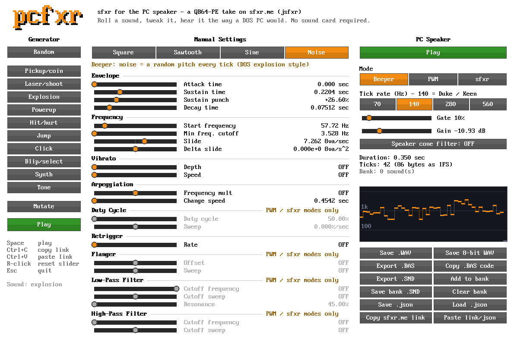
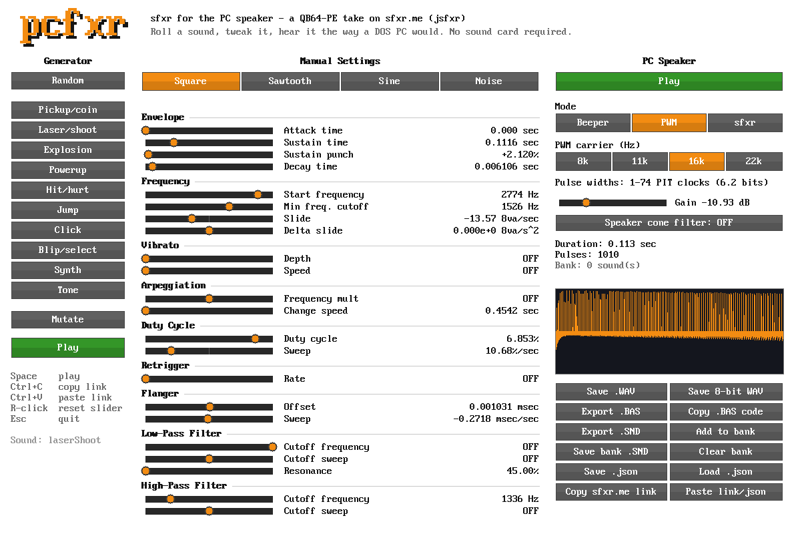
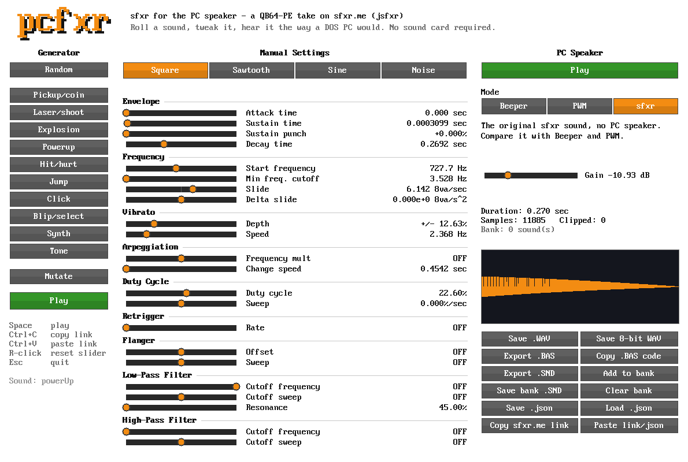

# PCSFXR (PC Speaker FXer): sfxr for the PC speaker

**Short version:** a QB64-PE version of [sfxr.me](https://sfxr.me/) (jsfxr), the
classic one-click game sound effect generator. Click **Explosion**,
**Laser/shoot**, **Pickup/coin** and so on, tweak the sliders, and hear the
sound **the way a DOS PC's built-in speaker would play it**. Then export it as a
Duke Nukem-style sound bank, a ready-to-run QB64-PE program, or a `.wav`.

It is written entirely in QB64-PE, with no C and no `DECLARE LIBRARY`, and is
built on the PC speaker emulator in [`../PC-SPEAKER`](../PC-SPEAKER).



Built and tested with the QB64-PE **v4.7.0-GLFW** compiler.

---

## Quick start

1. Open **`PCSFXR.BAS`** in QB64-PE.
2. Press **F5**.
3. Click any button under **Generator**. Each click rolls a new random sound of
   that kind and plays it.
4. Drag the sliders to change it. It plays again when you let go.
5. Try the three **Mode** buttons on the right to hear the same sound three ways.

| Input | What it does |
| --- | --- |
| Generator buttons | roll a new sound: Pickup/coin, Laser/shoot, Explosion, Powerup, Hit/hurt, Jump, Click, Blip/select, Synth, Tone, Random |
| Mutate | nudge every slider a little, for a variation on the same sound |
| Drag a slider | change that parameter. Right-click a slider to reset it. |
| Space | play again |
| Ctrl+C | copy the sound as an sfxr.me link |
| Ctrl+V | paste an sfxr.me link, a bare code or a `.json` |
| Drop a `.json` on the window | load it |
| Esc | quit |

---

## The three modes

The PC speaker can't play what sfxr normally makes. It is a 1-bit speaker
driven by a timer chip: it can play one square wave at a time, at full volume
or not at all. (See [`../PC-SPEAKER/README.md`](../PC-SPEAKER/README.md) for how
that hardware works.) So PCSFXR offers three ways to hear a sound:

### 1. Beeper (the default): how DOS games really did it

Duke Nukem 1, Commander Keen and friends stored each sound effect as a list of
timer-chip numbers ("divisors"), and changed the speaker's pitch **140 times a
second**. Beeper mode does exactly that. It runs sfxr's pitch engine (start
frequency, slide, vibrato, arpeggio, retrigger) and every tick writes down the
pitch as a divisor.

* **Tick rate:** 140 Hz is the Duke/Keen rate. Use 70 Hz for an even more
  stepped sound, or 280 or 560 Hz for smoother slides.
* **Gate:** the speaker has no volume knob, so the envelope can only turn it
  on or off. Below the gate level the speaker is silent. Raise the gate to
  shorten a sound's tail.
* **Noise** becomes a random pitch every tick. That's how DOS games made
  explosions.
* Duty cycle, flanger and the filters change the shape or volume of the wave,
  which a PC speaker can't do. In this mode they are greyed out and marked
  "PWM / sfxr modes only".

A sound made this way is a short list of numbers (a few dozen bytes), the same
data Duke Nukem 1 stores. That's what **Export .SND** and **Export .BAS**
save.

**Into PCSEDIT:** every `.SND` PCSFXR saves opens in
[PCSEDIT](../PC-SPEAKER/README.md#pcsedit-make-your-own-sounds) (and DN1PLAY
and the games). Whatever tick rate you made a sound at, the `.SND` is
written at the 140 steps a second they all play at. **Add to bank** collects
sounds; **Save bank .SND** asks where to save, and if you pick a bank that
already exists - one you're working on in PCSEDIT, say - it can add the new
sounds to it, keeping everything that's there (PCSEDIT's multi-voice sounds
too).

**Send to PCSEDIT** (the orange button at the bottom right) is quicker:
it puts the sound straight into the bank you have open in PCSEDIT, as a new
sound after the current one, within half a second. The two talk through an
inbox folder next to PCSEDIT's settings (`~/.config/pcsedit-inbox/`, or
`%APPDATA%\pcsedit-inbox\` on Windows). If PCSEDIT isn't running, PCSFXR
starts it when it's been compiled in `../PC-SPEAKER`; otherwise the sound
waits in the inbox for the next time PCSEDIT starts.

### 2. PWM: getting real audio out of a 1-bit speaker



The demo-scene trick: flip the speaker thousands of times a second and vary
how long it stays out each time. The cone can't keep up, so it averages the
pulses into a real waveform. PCSFXR renders the full sfxr sound, then plays it
through the emulated speaker this way, so every slider counts.

* **PWM carrier:** how often the speaker flips. 16 kHz gives 74 pulse widths
  (about 6 bits). 8 kHz gives more resolution but a louder whine.
* **Speaker cone filter:** softens the carrier whine the way a real speaker
  cone did.

This is how `../PC-SPEAKER/WAV.BAS` works. Games mostly couldn't afford it
because it used almost all the CPU time.

### 3. sfxr: the original



Plain sfxr output, for comparison. It sounds exactly like sfxr.me: the synth
was checked against jsfxr's own code and matches it sample for sample.

---

## Saving and sharing

Files are written to `EXPORT/`, next to the program, and named after the sound.

| Button | What you get |
| --- | --- |
| Save .WAV | the sound as you hear it in the current mode (16-bit `.wav`) |
| Save 8-bit WAV | the clean sound as 8 kHz 8-bit mono, the format `../PC-SPEAKER/WAV.BAS` plays through the PC speaker |
| Export .BAS | a complete QB64-PE program that plays the sound. Put `PCSPKR.BI` and `PCSPKR.BM` next to it. |
| Copy .BAS code | the same program, copied to the clipboard |
| Export .SND | a one-sound Duke Nukem 1 / Keen format sound bank. It opens in `../PC-SPEAKER/DN1PLAY.BAS`. |
| Add to bank / Save bank .SND | collect several sounds, then save them all as one bank, `EXPORT/PCSFXR.SND`. Your own Duke-style sound file. |
| Save .json / Load .json | sfxr.me's file format. A `.json` saved here loads on sfxr.me, and the other way round. |
| Copy sfxr.me link / Paste link/json | swap sounds with the website. Paste a link from sfxr.me into PCSFXR, or open a PCSFXR link in your browser. |

**Export .BAS**, **Export .SND** and the bank always use the Beeper version of
the sound, whichever mode is selected, because they store tick-by-tick
divisors.

---

## Using the engine in your own program

`SFXR.BI` / `SFXR.BM` are the synth on their own, without the window. Your game
can create sounds at run time, or load ones you designed in PCSFXR. `SFXDEMO.BAS`
shows both:

```basic
'$INCLUDE:'../PC-SPEAKER/PCSPKR.BI'
'$INCLUDE:'SFXR.BI'

DIM snd AS LONG
SFXR_Init
sfxr_mode = SFXR_MODE_BEEPER            ' or SFXR_MODE_PWM / SFXR_MODE_CLEAN

SFXR_Preset "explosion"                 ' roll a new random explosion...
snd = SFXR_Render
_SNDPLAY snd

IF SFXR_Import("https://sfxr.me/#34T6Pk...") THEN   ' ...or load a designed one
    snd = SFXR_Render
    _SNDPLAY snd
END IF
END

'$INCLUDE:'../PC-SPEAKER/PCSPKR.BM'
'$INCLUDE:'SFXR.BM'
```

Useful calls:

* `SFXR_Preset kind$`: `pickupCoin`, `laserShoot`, `explosion`, `powerUp`,
  `hitHurt`, `jump`, `click`, `blipSelect`, `synth`, `tone` or `random`
* `SFXR_Mutate`, `SFXR_Reset`
* `sfxr_p(SP_BASE_FREQ)` and the other `SP_*` indexes: the 22 parameters,
  0 to 1 (signed ones -1 to 1). `sfxr_p(0)` is the wave type. `sfxr_vol` is
  the gain.
* `sfxr_mode`, `sfxr_tickHz`, `sfxr_gate`, `sfxr_pwmHz`: PC speaker settings
* `SFXR_Render&`: synthesize and return a sound handle
* `SFXR_Import(text$)`, `SFXR_ToB58$`, `SFXR_ToJSON$`, `SFXR_FromJSON`:
  sfxr.me links and `.json`
* `SFXR_SaveWAV`, `SFXR_Save8BitWAV`, `SFXR_BasCode$`, `SFXR_DivisorData$`,
  `SFXR_BuildIFS$`: exports
* `sfxr_div()` / `sfxr_divN`: the beeper divisors, one per tick

## Files

| File | What it is |
| --- | --- |
| **`PCSFXR.BAS`** | **The app. Start here.** |
| `SFXR.BI` / `SFXR.BM` | The sfxr synth (ported from jsfxr) plus the Beeper and PWM renderers, `.json`/sfxr.me support and the exporters |
| `SFXDEMO.BAS` | Using the engine from your own code |
| `SCREENSHOTS/` | The images in this README |

It also uses `../PC-SPEAKER/PCSPKR.BI` and `PCSPKR.BM`, so keep the two folders
side by side.

## Credits

* [sfxr](https://www.drpetter.se/project_sfxr.html) by DrPetter: the original
  idea, synth and presets
* [jsfxr](https://github.com/chr15m/jsfxr) by Chris McCormick (chr15m) and
  contributors, released into the public domain (UNLICENSE). PCSFXR's synth,
  presets, parameter units, `.json` format and sfxr.me link codes are ported
  from its `sfxr.js`.
* The PC speaker emulation comes from `../PC-SPEAKER`, a port of NCOT
  Technology's [pc-speaker](https://github.com/ncot-tech/pc-speaker) code.

## Notes

* Built on a machine with no sound card, so the sound was checked by
  measurement. The clean synth matches jsfxr's output to within 0.0000001 per
  sample, and exported links, `.json` and `.SND` banks load in jsfxr and
  DN1PLAY.
* Very short sounds can turn into only a few ticks in Beeper mode (a 30 ms blip
  at 140 Hz is 4 ticks). That's authentic. Raise the tick rate if it's too
  choppy.
